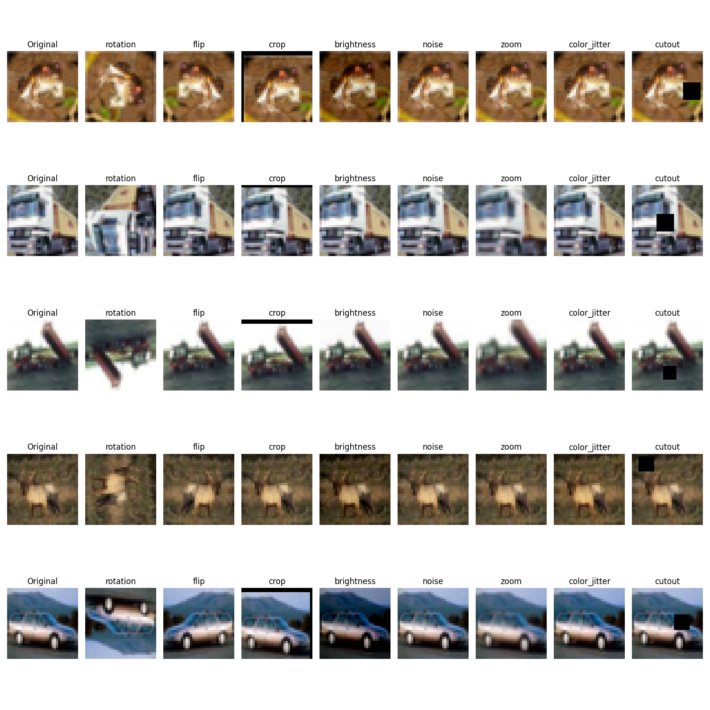

# Project Report: Image Classification with Data Augmentation

## Introduction

This project focuses on preparing a dataset for image classification by applying various data augmentation techniques to the CIFAR-10 dataset. The main objective in this phase is to generate a diverse and enriched dataset, which will be used in the subsequent phase to train a classification model and evaluate the performance improvements.

### Key Objectives of Phase 1:
1. Prepare the CIFAR-10 dataset with diverse augmentation methods.
2. Implement and validate the following augmentation techniques:
   - Rotation
   - Flip
   - Crop
   - Brightness Adjustment
   - Noise Injection
   - Zoom
   - Color Jittering
   - Cutout
3. Create a well-structured and visually validated augmented dataset.

---

## Implementation Details

### 1. Dataset Preparation
The CIFAR-10 dataset was downloaded and organized into directories for training and testing, with images categorized into 10 classes.

#### Key Steps:
- **Download Dataset**: Ensures the dataset is available locally.
- **Save Images**: Organizes images in labeled directories for efficient processing.

### 2. Data Augmentation

Eight data augmentation techniques were implemented to enrich the dataset. Each technique creates new variations of the images to improve diversity.

#### Techniques:
1. **Rotation**: Rotates images by 90°, 180°, or 270°.
2. **Flip**: Randomly flips images horizontally.
3. **Crop**: Randomly crops and resizes images.
4. **Brightness Adjustment**: Alters image brightness within a range.
5. **Noise Injection**: Adds Gaussian noise to images.
6. **Zoom**: Randomly zooms in on images.
7. **Color Jittering**: Modifies image saturation and color intensity.
8. **Cutout**: Masks random regions of the image to simulate occlusion.

#### Implementation:
- The `apply_augmentation()` method systematically applies each technique and saves results in organized directories.
- The `display_augmented_examples()` method visualizes augmented samples.

---

## Example Augmented Images

Below is an example showing original images and their augmented versions using different techniques:

---

## Phase 1 Observations

### Benefits of Data Augmentation:
- Improved variability and robustness in the dataset.
- Techniques like **Rotation** and **Flip** enhance orientation invariance.
- **Brightness Adjustment** and **Color Jittering** introduce lighting variations.
- **Noise Injection** and **Cutout** simulate real-world imperfections.

### Challenges:
- Excessive augmentation, such as overly aggressive **Cutout**, can obscure important features.
- Balancing augmentation parameters to retain meaningful data is critical.

---

## Next Steps: Phase 2

In the second phase, the augmented dataset will be used to train and evaluate a classification model. Results will be compared against models trained on the original dataset to quantify the impact of data augmentation.